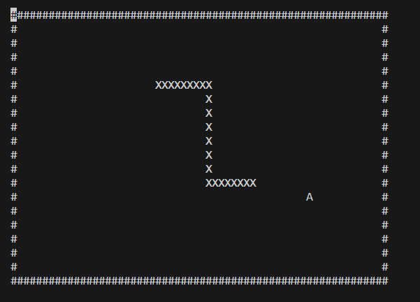

This is a little repository made for fun where I will try to code the original snake game in NodeJS!

The point is to use only the language's features, and writing all the code from scratch, no additional libraries required!

To start the game, have NodeJS installed, and call `node index.js` from the terminal. Have fun!

